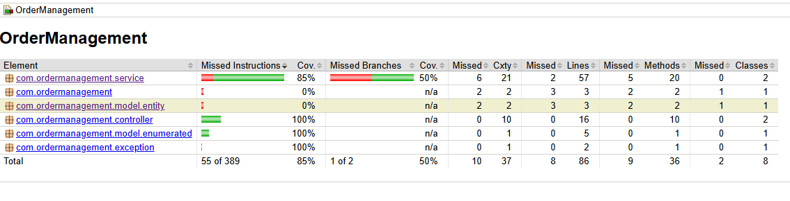

# Order Management

**Order Management** é um sistema de gerenciamento de pedidos desenvolvido com Spring Boot que integra com Kafka e utiliza um banco de dados PostgreSQL. O sistema permite criar, atualizar, buscar e deletar pedidos e produtos, além de calcular os valores totais dos pedidos. Os pedidos recebidos de um sistema externo são processados e enviados para outro sistema externo, ProdutoExternoB.

## Recursos e Funcionalidades

- **Endpoints RESTful**:
    - **Produto**:
        - `GET /api/produtos/{id}`: Busca um produto específico pelo ID.
        - `PUT /api/produtos/{id}`: Atualiza os dados de um produto existente.
        - `DELETE /api/produtos/{id}`: Remove um produto pelo ID.
        - `GET /api/produtos`: Lista todos os produtos.
        - `POST /api/produtos`: Cria um novo produto.

    - **Pedido**:
        - `GET /api/pedidos/{id}`: Busca um pedido específico pelo ID.
        - `PUT /api/pedidos/{id}`: Atualiza os dados de um pedido existente.
        - `DELETE /api/pedidos/{id}`: Remove um pedido pelo ID.
        - `GET /api/pedidos`: Lista todos os pedidos.
        - `POST /api/pedidos`: Cria um novo pedido.

## Configuração do Projeto

- **Spring Boot**:
    - `spring.application.name`: OrderManagement
    - `spring.datasource.url`: jdbc:postgresql://localhost:5432/postgres
    - `spring.datasource.username`: seuuser
    - `spring.datasource.password`: suasenha
    - `spring.kafka.version`: 3.0.0

## Integração com Kafka

- Os pedidos são recebidos de um sistema chamado `ProdutoExternoA`, que publica na fila Kafka `pedidos-topic`.
- O sistema consome dessa fila e processa esses pedidos 
- Calcula o valor total dos pedidos
- E publica na fila `pedidos-resumo-topic` que será consumida pelo sistema `ProdutoExternoB`.

## Swagger

- **URL do Swagger**: [Swagger UI](http://localhost:8080/swagger-ui.html)

# Relatórios de Cobertura JaCoCo

Para visualizar os relatórios de cobertura do JaCoCo após executar os testes de unidade, siga as etapas abaixo:

1. **Execute os Testes de Unidade**:
    - No terminal, navegue até o diretório raiz do projeto e execute:
      ```bash
      ./mvn clean install
      ```

2. **Geração do Relatório JaCoCo**:
    - Após a execução dos testes, os relatórios de cobertura serão gerados na pasta `target/site`.
    - Para visualizar o relatório HTML, abra o navegador e vá até o seguinte caminho:
      ```bash
      open target/site/jacoco/index.html
      ```
    - Isso abrirá o relatório no seu navegador padrão, mostrando a cobertura de código por classe, método e linha.

3. **Visualizando o Relatório**:
    